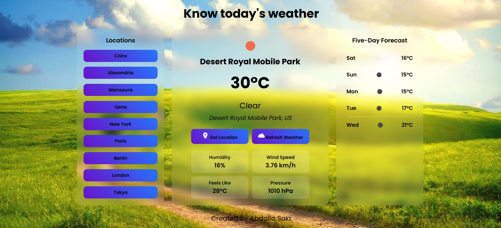

# Know today's weather

A sleek weather dashboard for Egyptian cities (Cairo, Alexandria, Mansoura, Qena),  
showcasing current weather and a 5-day forecast. Built with HTML, CSS, and JavaScript,  
powered by the OpenWeatherMap API, and styled with a modern glassmorphism UI.

## Features

- Real-time weather data: temperature, condition, humidity, wind speed, feels like, and pressure.
- 5-day forecast with daily updates.
- Geolocation-based weather for the user's location.
- Dynamic backgrounds that adapt to weather conditions.
- Responsive design with a glassmorphism aesthetic.

## Technologies

- **HTML**: Page structure.
- **CSS**: Glassmorphism styling and responsive layout.
- **JavaScript**: Fetch API for data retrieval, Geolocation API for location.
- **OpenWeatherMap API**: Weather data provider.

## live Demo 
[click here for try](https://abdallaskar.github.io/Weather_today/)
## youtube video
[Click here to watch vedio](https://youtu.be/jzM1DEQOM8g)

## Screenshots


## Installation
1. Clone the repository:
   ```bash
   git clone https://github.com/abdallaskar/Weather_today

